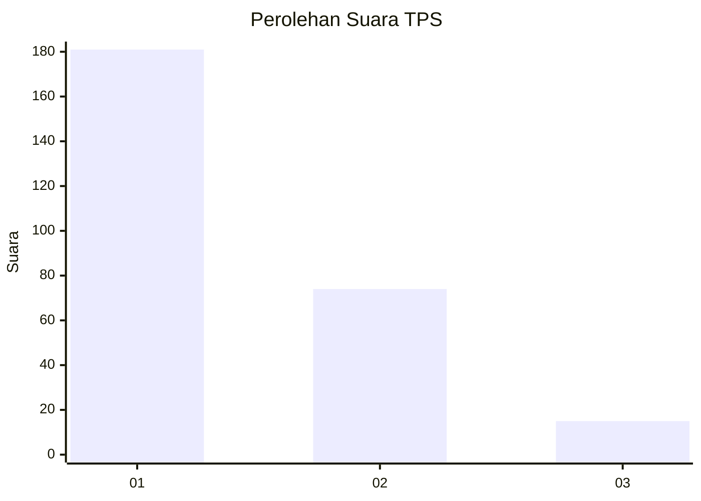
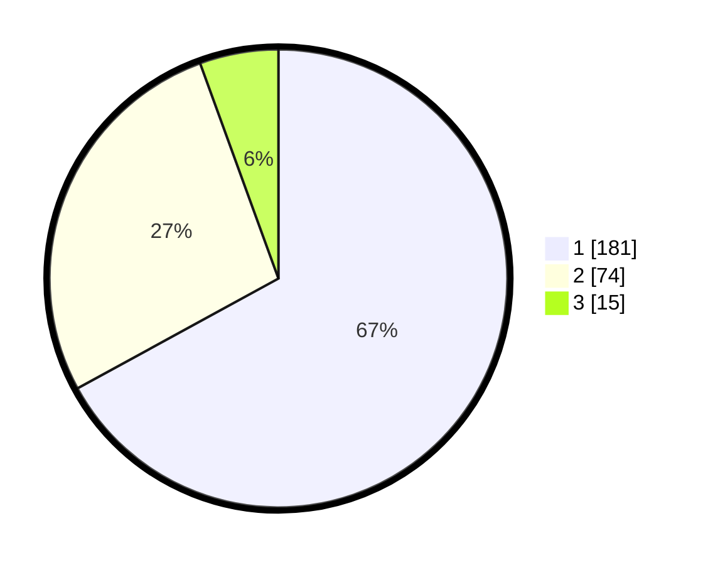

# Hasil

## Grafik

## Tabel

| No. | Nama Paslon    | Suara | Suara (raw) | Persentase |
|:--- |:-------------- | -----:| -----------:| ----------:|
| 1   | ANIES MUHAIMIN | 181   | [181][p-1]  | 67,04      |
| 2   | PRABOWO GIBRAN | 74    | [74][p-2]   | 27,41      |
| 3   | GANJAR MAHFUD  | 15    | [15][p-3]   | 5,56       |

[p-1]: https://github.com/gigit-pemilu/pemilu-2024-15-jambi/blob/main/pilpres/hitung-suara/sub/15-jambi/sub/71-kota-jambi/sub/04-pasar-jambi/sub/1004-sungai-asam/sub/013-tps/sub/paslon-1.txt
[p-2]: https://github.com/gigit-pemilu/pemilu-2024-15-jambi/blob/main/pilpres/hitung-suara/sub/15-jambi/sub/71-kota-jambi/sub/04-pasar-jambi/sub/1004-sungai-asam/sub/013-tps/sub/paslon-2.txt
[p-3]: https://github.com/gigit-pemilu/pemilu-2024-15-jambi/blob/main/pilpres/hitung-suara/sub/15-jambi/sub/71-kota-jambi/sub/04-pasar-jambi/sub/1004-sungai-asam/sub/013-tps/sub/paslon-3.txt

## Foto C Plano

https://sirekap-obj-formc.kpu.go.id/902f/pemilu/ppwp/15/71/04/10/04/1571041004013-20240215-035405--5f9b2447-fa01-4781-a1eb-f51cb7d78ead.jpg

https://sirekap-obj-formc.kpu.go.id/902f/pemilu/ppwp/15/71/04/10/04/1571041004013-20240215-035643--0484deda-45b3-4915-a184-9ea7dda31e5a.jpg

https://sirekap-obj-formc.kpu.go.id/902f/pemilu/ppwp/15/71/04/10/04/1571041004013-20240215-174817--92aa7944-3480-47cb-b2c1-db51f6d2f3b7.jpg

## Metadata

| Key        | Value               |
| ---------- | ------------------- |
| Time Stamp | 2024-02-16 03:00:26 |

