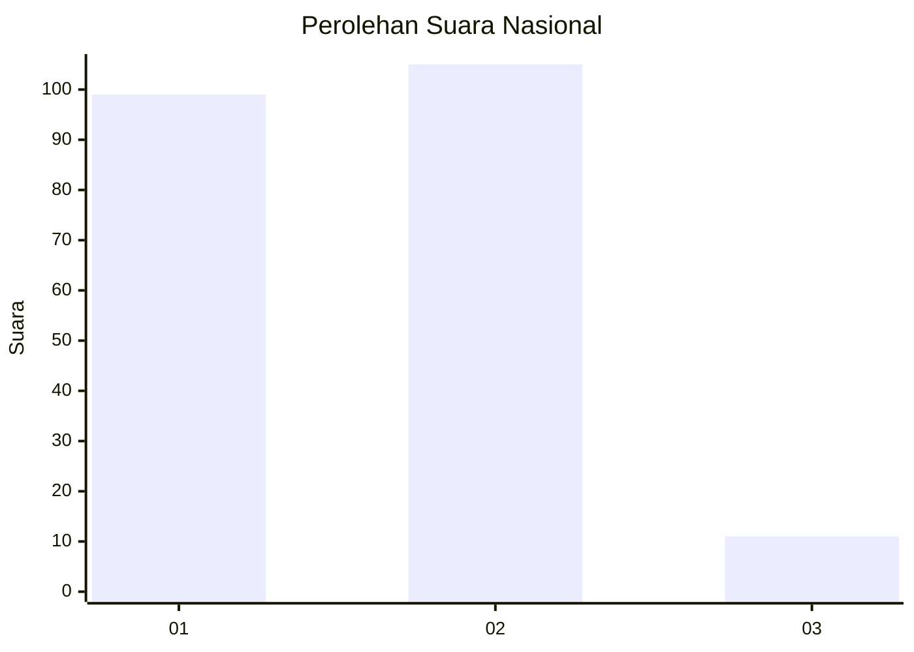
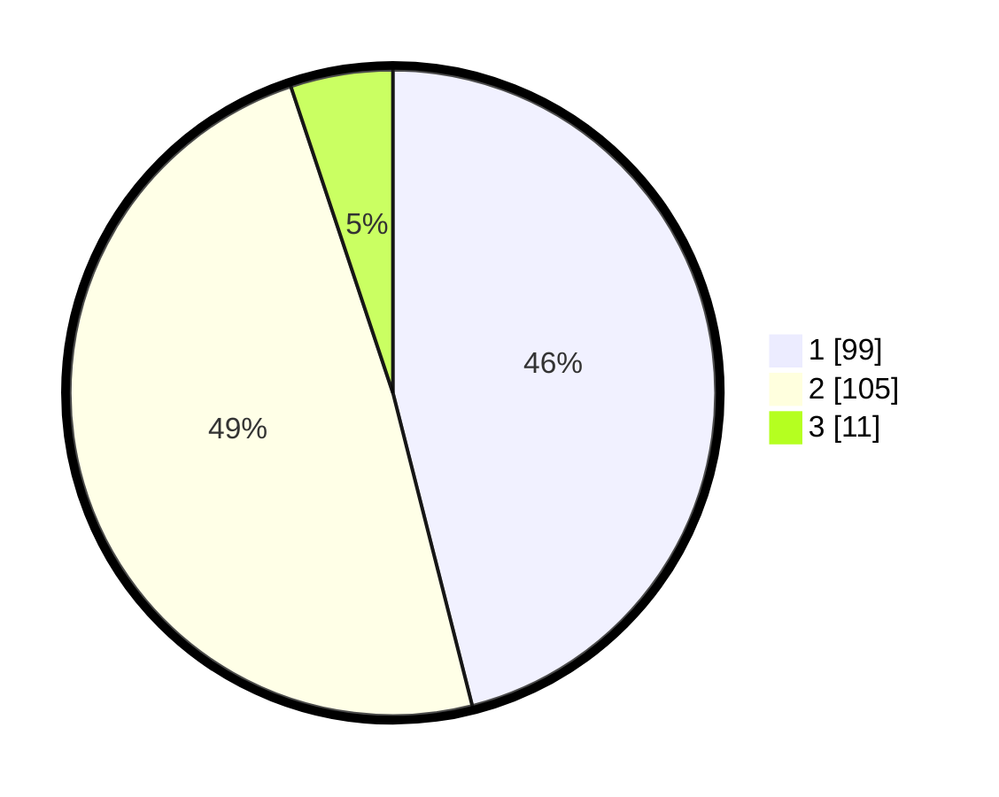

# Hasil

## Grafik

## Tabel

| No. | Nama Paslon    | Suara | Suara (raw) | Persentase |
|:--- |:-------------- | -----:| -----------:| ----------:|
| 1   | ANIES MUHAIMIN | 99    | [99][p-1]   | 46,05      |
| 2   | PRABOWO GIBRAN | 105   | [105][p-2]  | 48,84      |
| 3   | GANJAR MAHFUD  | 11    | [11][p-3]   | 5,12       |

[p-1]: https://github.com/gigit-pemilu/pemilu-2024/blob/main/pilpres/hitung-suara/sub/15-jambi/sub/71-kota-jambi/sub/05-pelayangan/sub/1001-arab-melayu/sub/003-tps/sub/paslon-1.txt
[p-2]: https://github.com/gigit-pemilu/pemilu-2024/blob/main/pilpres/hitung-suara/sub/15-jambi/sub/71-kota-jambi/sub/05-pelayangan/sub/1001-arab-melayu/sub/003-tps/sub/paslon-2.txt
[p-3]: https://github.com/gigit-pemilu/pemilu-2024/blob/main/pilpres/hitung-suara/sub/15-jambi/sub/71-kota-jambi/sub/05-pelayangan/sub/1001-arab-melayu/sub/003-tps/sub/paslon-3.txt

## Foto C Plano

https://sirekap-obj-formc.kpu.go.id/cd72/pemilu/ppwp/15/71/05/10/01/1571051001003-20240215-054021--6de28df1-6a67-49b8-bf85-fd96777f12e1.jpg

https://sirekap-obj-formc.kpu.go.id/cd72/pemilu/ppwp/15/71/05/10/01/1571051001003-20240215-054045--2fc8f7ed-6663-4449-b808-584880ccccc9.jpg

https://sirekap-obj-formc.kpu.go.id/cd72/pemilu/ppwp/15/71/05/10/01/1571051001003-20240215-054112--c1960e2a-281b-4f21-82e8-3758f0b694b9.jpg

## Metadata

| Key        | Value               |
| ---------- | ------------------- |
| Time Stamp | 2024-02-15 21:30:27 |

