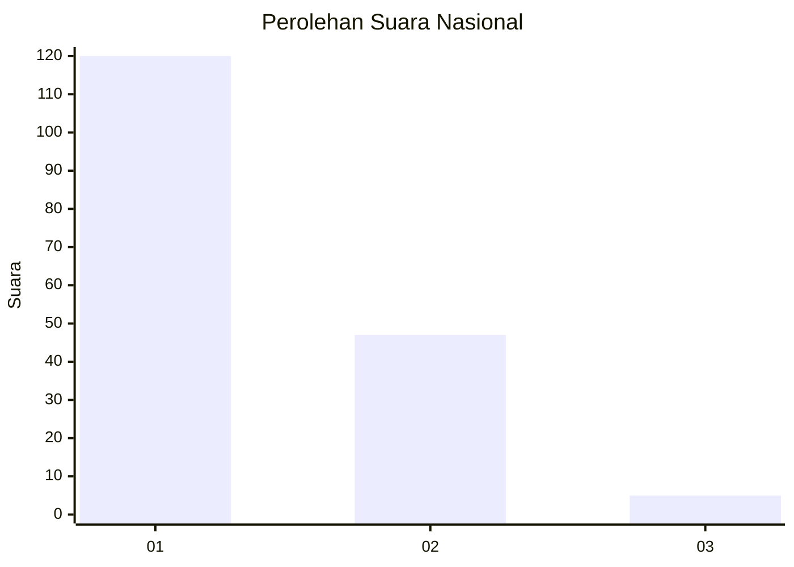
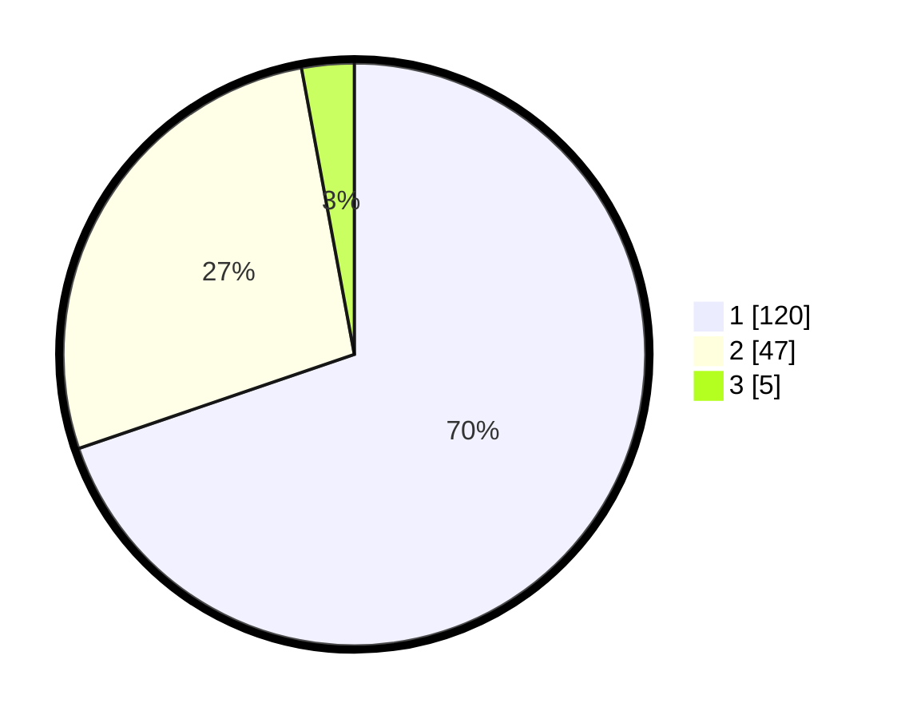

# Hasil

## Grafik

## Tabel

| No. | Nama Paslon    | Suara | Suara (raw) | Persentase |
|:--- |:-------------- | -----:| -----------:| ----------:|
| 1   | ANIES MUHAIMIN | 120   | [120][p-1]  | 69,77      |
| 2   | PRABOWO GIBRAN | 47    | [47][p-2]   | 27,33      |
| 3   | GANJAR MAHFUD  | 5     | [5][p-3]    | 2,91       |

[p-1]: https://github.com/gigit-pemilu/pemilu-2024/blob/main/pilpres/hitung-suara/sub/15-jambi/sub/71-kota-jambi/sub/05-pelayangan/sub/1001-arab-melayu/sub/004-tps/sub/paslon-1.txt
[p-2]: https://github.com/gigit-pemilu/pemilu-2024/blob/main/pilpres/hitung-suara/sub/15-jambi/sub/71-kota-jambi/sub/05-pelayangan/sub/1001-arab-melayu/sub/004-tps/sub/paslon-2.txt
[p-3]: https://github.com/gigit-pemilu/pemilu-2024/blob/main/pilpres/hitung-suara/sub/15-jambi/sub/71-kota-jambi/sub/05-pelayangan/sub/1001-arab-melayu/sub/004-tps/sub/paslon-3.txt

## Foto C Plano

https://sirekap-obj-formc.kpu.go.id/3123/pemilu/ppwp/15/71/05/10/01/1571051001004-20240214-233917--ecf594aa-3372-42b6-ba89-940fa482cc47.jpg

https://sirekap-obj-formc.kpu.go.id/3123/pemilu/ppwp/15/71/05/10/01/1571051001004-20240214-234022--ad6c0f6a-b54f-4de7-8948-35349dc77246.jpg

https://sirekap-obj-formc.kpu.go.id/3123/pemilu/ppwp/15/71/05/10/01/1571051001004-20240214-234058--633e843b-ec24-496e-9ba5-8c68f2988f1f.jpg

## Metadata

| Key        | Value               |
| ---------- | ------------------- |
| Time Stamp | 2024-02-15 19:30:26 |

