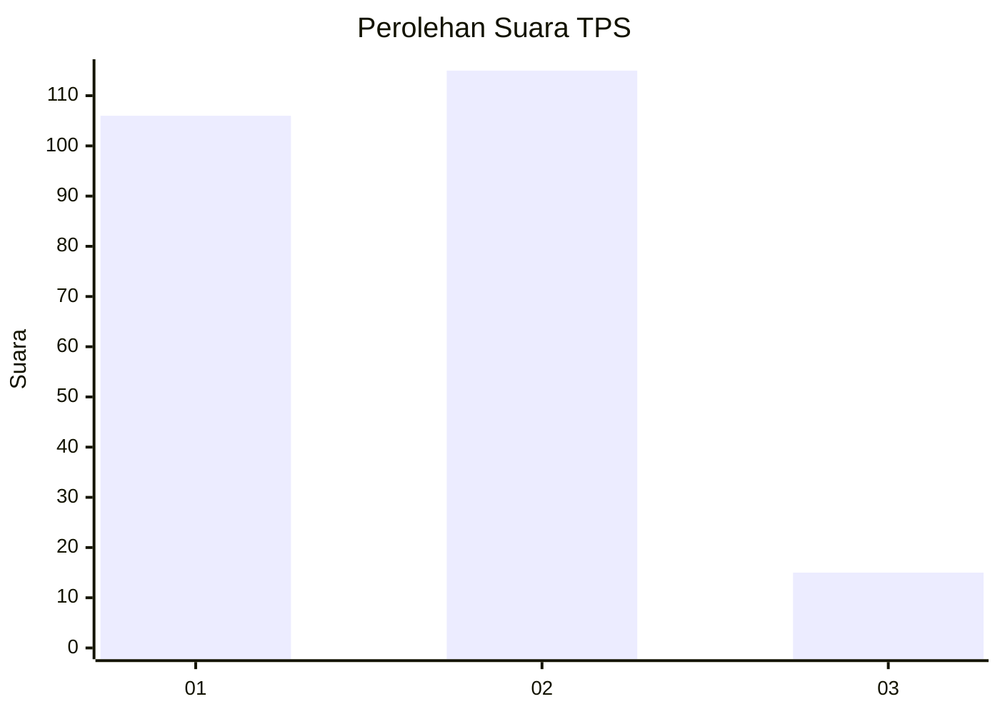
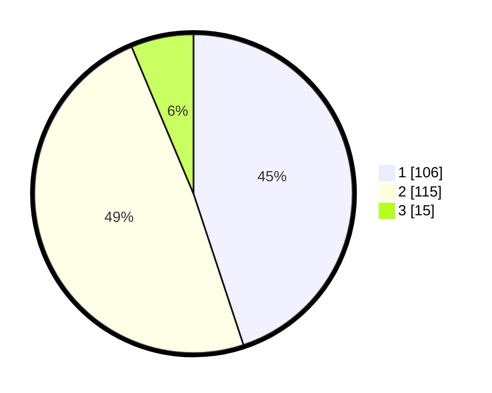

# Hasil

## Grafik

## Tabel

| No. | Nama Paslon    | Suara | Suara (raw) | Persentase |
|:--- |:-------------- | -----:| -----------:| ----------:|
| 1   | ANIES MUHAIMIN | 106   | [106][p-1]  | 44,92      |
| 2   | PRABOWO GIBRAN | 115   | [115][p-2]  | 48,73      |
| 3   | GANJAR MAHFUD  | 15    | [15][p-3]   | 6,36       |

[p-1]: https://github.com/gigit-pemilu/pemilu-2024-15-jambi/blob/main/pilpres/hitung-suara/sub/15-jambi/sub/71-kota-jambi/sub/06-danau-teluk/sub/1001-pasir-panjang/sub/005-tps/sub/paslon-1.txt
[p-2]: https://github.com/gigit-pemilu/pemilu-2024-15-jambi/blob/main/pilpres/hitung-suara/sub/15-jambi/sub/71-kota-jambi/sub/06-danau-teluk/sub/1001-pasir-panjang/sub/005-tps/sub/paslon-2.txt
[p-3]: https://github.com/gigit-pemilu/pemilu-2024-15-jambi/blob/main/pilpres/hitung-suara/sub/15-jambi/sub/71-kota-jambi/sub/06-danau-teluk/sub/1001-pasir-panjang/sub/005-tps/sub/paslon-3.txt

## Foto C Plano

https://sirekap-obj-formc.kpu.go.id/378f/pemilu/ppwp/15/71/06/10/01/1571061001005-20240215-004620--fc351883-edb7-4f14-9dc6-08fc185c8a3b.jpg

https://sirekap-obj-formc.kpu.go.id/378f/pemilu/ppwp/15/71/06/10/01/1571061001005-20240215-011251--51c83689-a0c8-4225-9640-21396d19cefa.jpg

https://sirekap-obj-formc.kpu.go.id/378f/pemilu/ppwp/15/71/06/10/01/1571061001005-20240215-004904--a807fb6e-fcd5-43a4-adcc-41c28cdae441.jpg

## Metadata

| Key        | Value               |
| ---------- | ------------------- |
| Time Stamp | 2024-02-15 23:29:50 |

