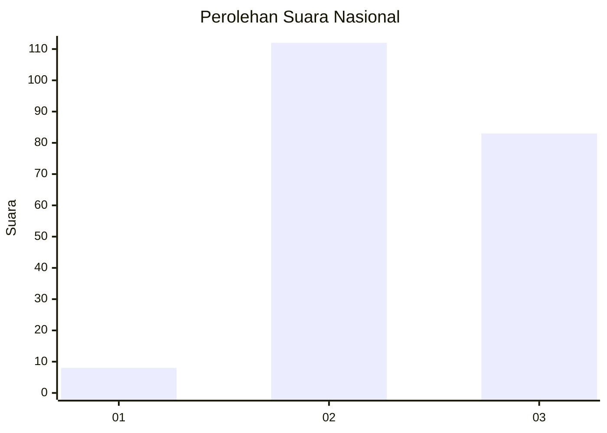
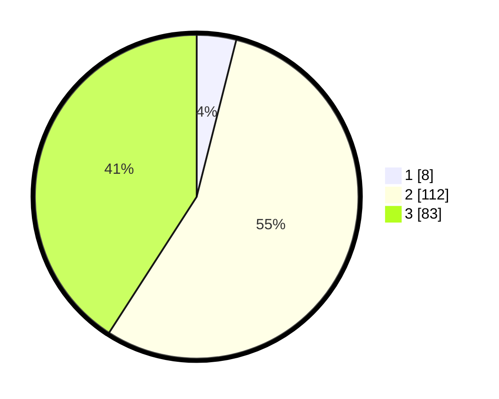

# Hasil

## Grafik

## Tabel

| No. | Nama Paslon    | Suara | Suara (raw) | Persentase |
|:--- |:-------------- | -----:| -----------:| ----------:|
| 1   | ANIES MUHAIMIN | 8     | [8][p-1]    | 3,94       |
| 2   | PRABOWO GIBRAN | 112   | [112][p-2]  | 55,17      |
| 3   | GANJAR MAHFUD  | 83    | [83][p-3]   | 40,89      |

[p-1]: https://github.com/gigit-pemilu/pemilu-2024/blob/main/pilpres/hitung-suara/sub/15-jambi/sub/71-kota-jambi/sub/08-jelutung/sub/1001-talang-jauh/sub/002-tps/sub/paslon-1.txt
[p-2]: https://github.com/gigit-pemilu/pemilu-2024/blob/main/pilpres/hitung-suara/sub/15-jambi/sub/71-kota-jambi/sub/08-jelutung/sub/1001-talang-jauh/sub/002-tps/sub/paslon-2.txt
[p-3]: https://github.com/gigit-pemilu/pemilu-2024/blob/main/pilpres/hitung-suara/sub/15-jambi/sub/71-kota-jambi/sub/08-jelutung/sub/1001-talang-jauh/sub/002-tps/sub/paslon-3.txt

## Foto C Plano

https://sirekap-obj-formc.kpu.go.id/721d/pemilu/ppwp/15/71/08/10/01/1571081001002-20240218-103756--685d3d27-7feb-4eff-9ffe-8a81572c03b4.jpg

https://sirekap-obj-formc.kpu.go.id/721d/pemilu/ppwp/15/71/08/10/01/1571081001002-20240218-103856--9ef5818d-2b1e-4120-a365-49375ef7f8be.jpg

https://sirekap-obj-formc.kpu.go.id/721d/pemilu/ppwp/15/71/08/10/01/1571081001002-20240218-104008--36d7e301-1153-4251-96a2-355298d2836a.jpg

## Metadata

| Key        | Value               |
| ---------- | ------------------- |
| Time Stamp | 2024-02-19 13:00:00 |

