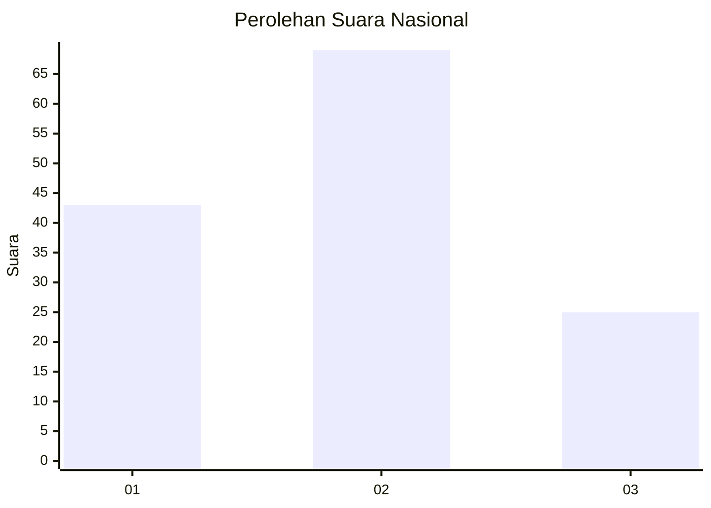
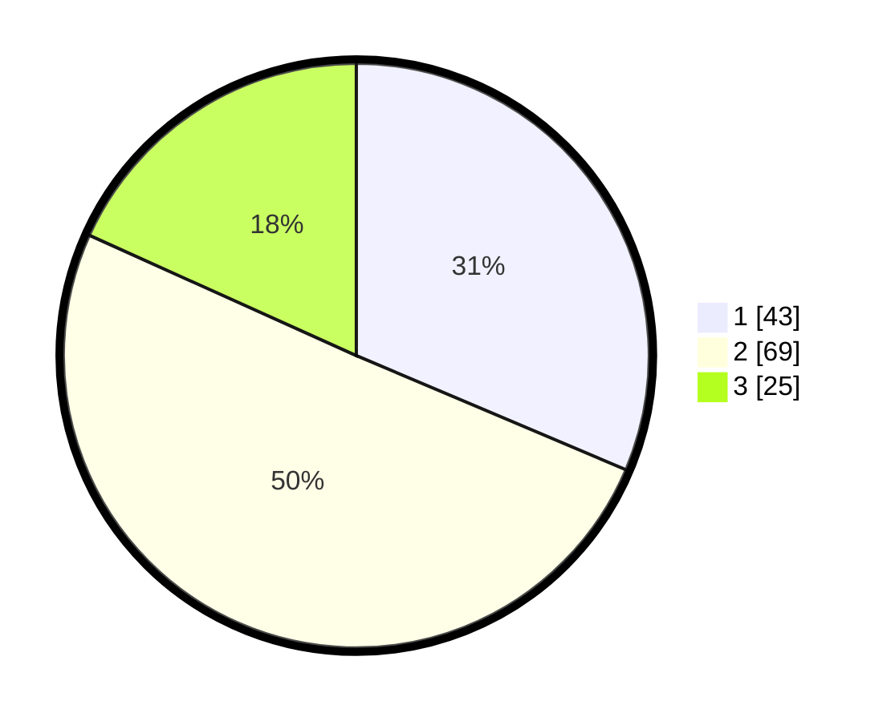

# Hasil

## Grafik

## Tabel

| No. | Nama Paslon    | Suara | Suara (raw) | Persentase |
|:--- |:-------------- | -----:| -----------:| ----------:|
| 1   | ANIES MUHAIMIN | 43    | [43][p-1]   | 31,39      |
| 2   | PRABOWO GIBRAN | 69    | [69][p-2]   | 50,36      |
| 3   | GANJAR MAHFUD  | 25    | [25][p-3]   | 18,25      |

[p-1]: https://github.com/gigit-pemilu/pemilu-2024/blob/main/pilpres/hitung-suara/sub/15-jambi/sub/71-kota-jambi/sub/08-jelutung/sub/1001-talang-jauh/sub/004-tps/sub/paslon-1.txt
[p-2]: https://github.com/gigit-pemilu/pemilu-2024/blob/main/pilpres/hitung-suara/sub/15-jambi/sub/71-kota-jambi/sub/08-jelutung/sub/1001-talang-jauh/sub/004-tps/sub/paslon-2.txt
[p-3]: https://github.com/gigit-pemilu/pemilu-2024/blob/main/pilpres/hitung-suara/sub/15-jambi/sub/71-kota-jambi/sub/08-jelutung/sub/1001-talang-jauh/sub/004-tps/sub/paslon-3.txt

## Foto C Plano

https://sirekap-obj-formc.kpu.go.id/f8b2/pemilu/ppwp/15/71/08/10/01/1571081001004-20240214-210454--4163de36-6cef-4a82-a3f9-8db65e94bee0.jpg

https://sirekap-obj-formc.kpu.go.id/f8b2/pemilu/ppwp/15/71/08/10/01/1571081001004-20240214-203029--573cbadc-241e-407f-bd58-fac0c547df64.jpg

https://sirekap-obj-formc.kpu.go.id/f8b2/pemilu/ppwp/15/71/08/10/01/1571081001004-20240214-200157--38add75f-821f-404a-a6aa-fc28f049e2ab.jpg

## Metadata

| Key        | Value               |
| ---------- | ------------------- |
| Time Stamp | 2024-02-16 00:00:26 |

