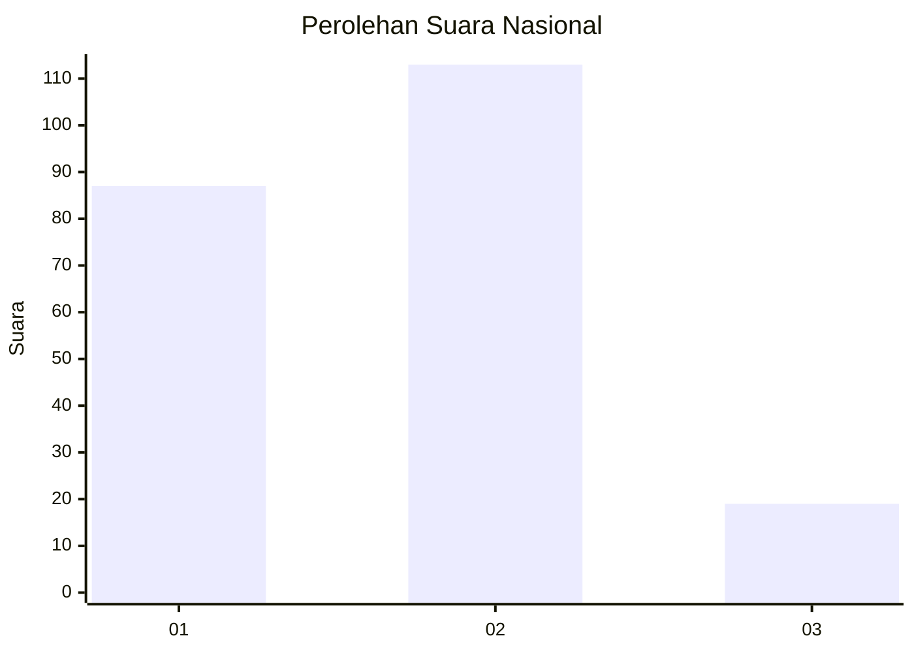
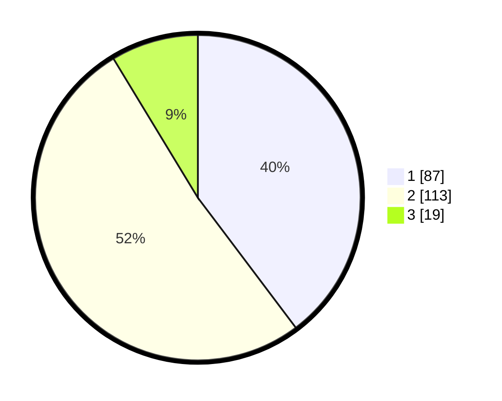

# Hasil

## Grafik

## Tabel

| No. | Nama Paslon    | Suara | Suara (raw) | Persentase |
|:--- |:-------------- | -----:| -----------:| ----------:|
| 1   | ANIES MUHAIMIN | 87    | [87][p-1]   | 39,73      |
| 2   | PRABOWO GIBRAN | 113   | [113][p-2]  | 51,60      |
| 3   | GANJAR MAHFUD  | 19    | [19][p-3]   | 8,68       |

[p-1]: https://github.com/gigit-pemilu/pemilu-2024/blob/main/pilpres/hitung-suara/sub/15-jambi/sub/71-kota-jambi/sub/09-alam-barajo/sub/1001-kenali-besar/sub/002-tps/sub/paslon-1.txt
[p-2]: https://github.com/gigit-pemilu/pemilu-2024/blob/main/pilpres/hitung-suara/sub/15-jambi/sub/71-kota-jambi/sub/09-alam-barajo/sub/1001-kenali-besar/sub/002-tps/sub/paslon-2.txt
[p-3]: https://github.com/gigit-pemilu/pemilu-2024/blob/main/pilpres/hitung-suara/sub/15-jambi/sub/71-kota-jambi/sub/09-alam-barajo/sub/1001-kenali-besar/sub/002-tps/sub/paslon-3.txt

## Foto C Plano

https://sirekap-obj-formc.kpu.go.id/ffdd/pemilu/ppwp/15/71/09/10/01/1571091001002-20240214-214322--7abc471d-f1a5-4bdb-9be0-139deda98371.jpg

https://sirekap-obj-formc.kpu.go.id/ffdd/pemilu/ppwp/15/71/09/10/01/1571091001002-20240214-214330--1df66aff-bc04-4184-8101-aa9ca8e9e9f3.jpg

https://sirekap-obj-formc.kpu.go.id/ffdd/pemilu/ppwp/15/71/09/10/01/1571091001002-20240214-214335--361fa504-c4b2-4e20-89ab-e459570d9c81.jpg

## Metadata

| Key        | Value               |
| ---------- | ------------------- |
| Time Stamp | 2024-02-15 23:29:50 |

