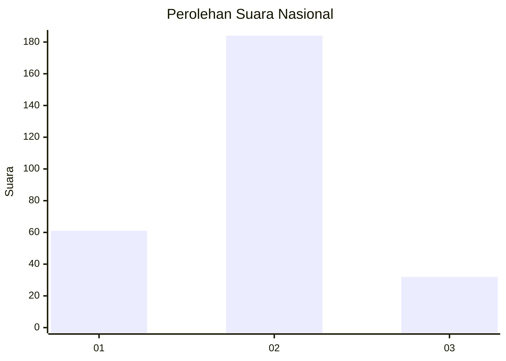
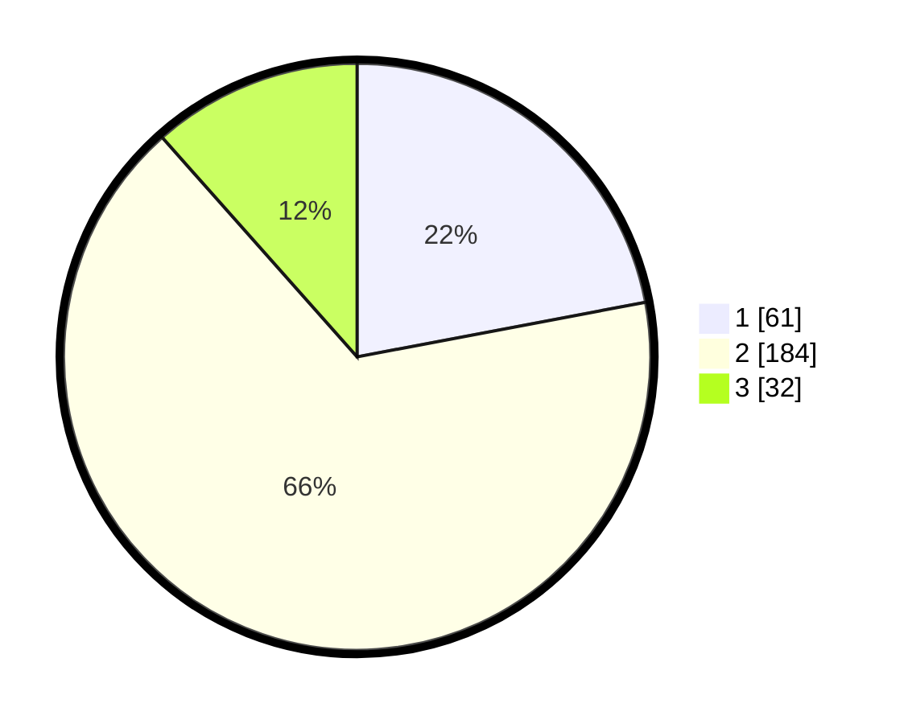

# Hasil

## Grafik

## Tabel

| No. | Nama Paslon    | Suara | Suara (raw) | Persentase |
|:--- |:-------------- | -----:| -----------:| ----------:|
| 1   | ANIES MUHAIMIN | 61    | [61][p-1]   | 22,02      |
| 2   | PRABOWO GIBRAN | 184   | [184][p-2]  | 66,43      |
| 3   | GANJAR MAHFUD  | 32    | [32][p-3]   | 11,55      |

[p-1]: https://github.com/gigit-pemilu/pemilu-2024/blob/main/pilpres/hitung-suara/sub/15-jambi/sub/71-kota-jambi/sub/09-alam-barajo/sub/1001-kenali-besar/sub/068-tps/sub/paslon-1.txt
[p-2]: https://github.com/gigit-pemilu/pemilu-2024/blob/main/pilpres/hitung-suara/sub/15-jambi/sub/71-kota-jambi/sub/09-alam-barajo/sub/1001-kenali-besar/sub/068-tps/sub/paslon-2.txt
[p-3]: https://github.com/gigit-pemilu/pemilu-2024/blob/main/pilpres/hitung-suara/sub/15-jambi/sub/71-kota-jambi/sub/09-alam-barajo/sub/1001-kenali-besar/sub/068-tps/sub/paslon-3.txt

## Foto C Plano

https://sirekap-obj-formc.kpu.go.id/ed6d/pemilu/ppwp/15/71/09/10/01/1571091001068-20240216-083714--5e37dd58-f25f-4ad3-a692-cc19858a3669.jpg

https://sirekap-obj-formc.kpu.go.id/ed6d/pemilu/ppwp/15/71/09/10/01/1571091001068-20240215-193745--532e1e9c-6095-4577-ad82-ada4d366a9d9.jpg

https://sirekap-obj-formc.kpu.go.id/ed6d/pemilu/ppwp/15/71/09/10/01/1571091001068-20240215-194524--c7e6012e-5fb6-4382-bcc7-c02218ef56b2.jpg

## Metadata

| Key        | Value               |
| ---------- | ------------------- |
| Time Stamp | 2024-02-16 09:00:28 |

