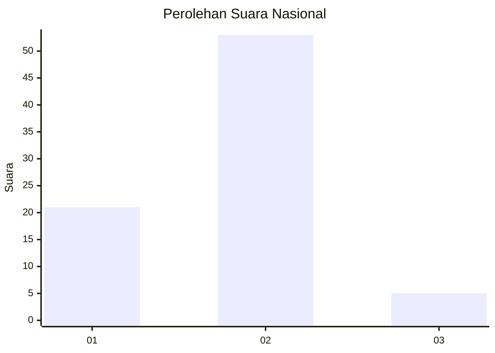
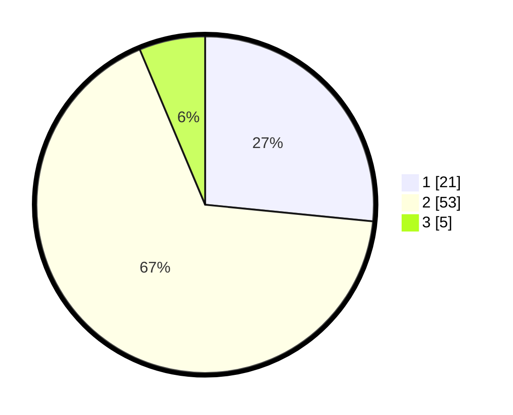

# Hasil

## Grafik

## Tabel

| No. | Nama Paslon    | Suara | Suara (raw) | Persentase |
|:--- |:-------------- | -----:| -----------:| ----------:|
| 1   | ANIES MUHAIMIN | 21    | [21][p-1]   | 26,58      |
| 2   | PRABOWO GIBRAN | 53    | [53][p-2]   | 67,09      |
| 3   | GANJAR MAHFUD  | 5     | [5][p-3]    | 6,33       |

[p-1]: https://github.com/gigit-pemilu/pemilu-2024/blob/main/pilpres/hitung-suara/sub/15-jambi/sub/71-kota-jambi/sub/09-alam-barajo/sub/1006-simpang-rimbo/sub/067-tps/sub/paslon-1.txt
[p-2]: https://github.com/gigit-pemilu/pemilu-2024/blob/main/pilpres/hitung-suara/sub/15-jambi/sub/71-kota-jambi/sub/09-alam-barajo/sub/1006-simpang-rimbo/sub/067-tps/sub/paslon-2.txt
[p-3]: https://github.com/gigit-pemilu/pemilu-2024/blob/main/pilpres/hitung-suara/sub/15-jambi/sub/71-kota-jambi/sub/09-alam-barajo/sub/1006-simpang-rimbo/sub/067-tps/sub/paslon-3.txt

## Foto C Plano

https://sirekap-obj-formc.kpu.go.id/2db0/pemilu/ppwp/15/71/09/10/06/1571091006067-20240215-111559--d81f46d9-d5b6-4ec2-b7fc-e1294ee9840f.jpg

https://sirekap-obj-formc.kpu.go.id/2db0/pemilu/ppwp/15/71/09/10/06/1571091006067-20240215-111633--ab296e11-c0f5-4348-8a1a-c3733b88c547.jpg

https://sirekap-obj-formc.kpu.go.id/2db0/pemilu/ppwp/15/71/09/10/06/1571091006067-20240215-111703--4a26edfd-5c45-482b-8c6a-0486f9658aa9.jpg

## Metadata

| Key        | Value               |
| ---------- | ------------------- |
| Time Stamp | 2024-02-15 16:00:26 |

