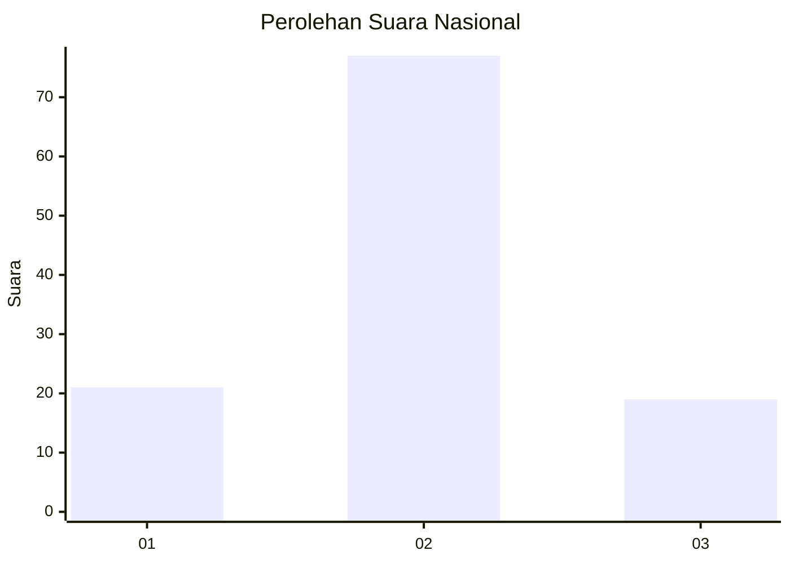
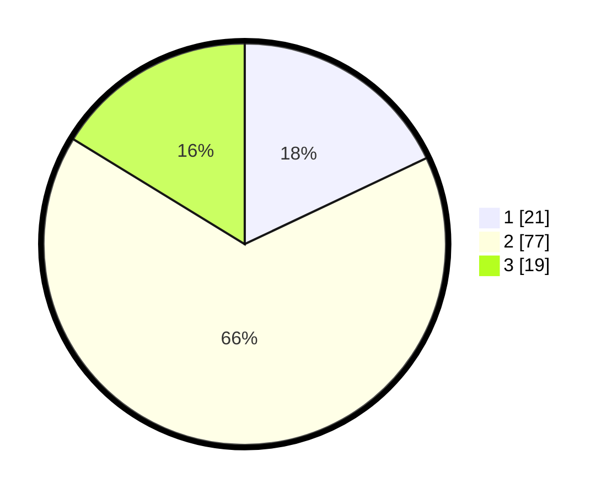

# Hasil

## Grafik

## Tabel

| No. | Nama Paslon    | Suara | Suara (raw) | Persentase |
|:--- |:-------------- | -----:| -----------:| ----------:|
| 1   | ANIES MUHAIMIN | 21    | [21][p-1]   | 17,95      |
| 2   | PRABOWO GIBRAN | 77    | [77][p-2]   | 65,81      |
| 3   | GANJAR MAHFUD  | 19    | [19][p-3]   | 16,24      |

[p-1]: https://github.com/gigit-pemilu/pemilu-2024/blob/main/pilpres/hitung-suara/sub/15-jambi/sub/71-kota-jambi/sub/10-danau-sipin/sub/1001-sungai-putri/sub/004-tps/sub/paslon-1.txt
[p-2]: https://github.com/gigit-pemilu/pemilu-2024/blob/main/pilpres/hitung-suara/sub/15-jambi/sub/71-kota-jambi/sub/10-danau-sipin/sub/1001-sungai-putri/sub/004-tps/sub/paslon-2.txt
[p-3]: https://github.com/gigit-pemilu/pemilu-2024/blob/main/pilpres/hitung-suara/sub/15-jambi/sub/71-kota-jambi/sub/10-danau-sipin/sub/1001-sungai-putri/sub/004-tps/sub/paslon-3.txt

## Foto C Plano

https://sirekap-obj-formc.kpu.go.id/ae8e/pemilu/ppwp/15/71/10/10/01/1571101001004-20240215-115328--1c6dbafe-ee6f-4f5a-beaf-bbc0e6d88eee.jpg

https://sirekap-obj-formc.kpu.go.id/ae8e/pemilu/ppwp/15/71/10/10/01/1571101001004-20240215-120824--8cd30bc5-6011-4140-bca1-0657aa30ebe4.jpg

https://sirekap-obj-formc.kpu.go.id/ae8e/pemilu/ppwp/15/71/10/10/01/1571101001004-20240215-163854--dc58d947-c04e-4f64-9388-177f2920d049.jpg

## Metadata

| Key        | Value               |
| ---------- | ------------------- |
| Time Stamp | 2024-02-15 18:30:25 |

