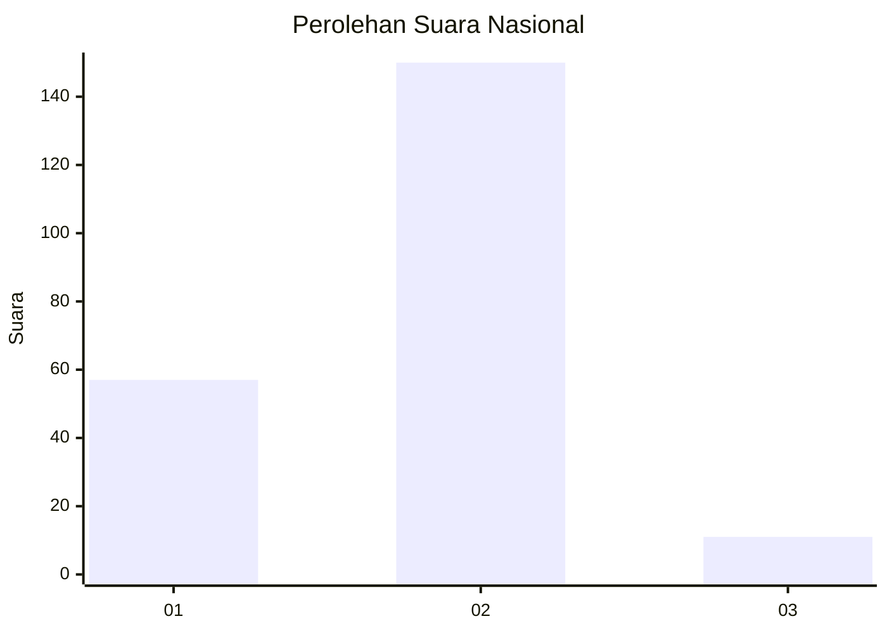
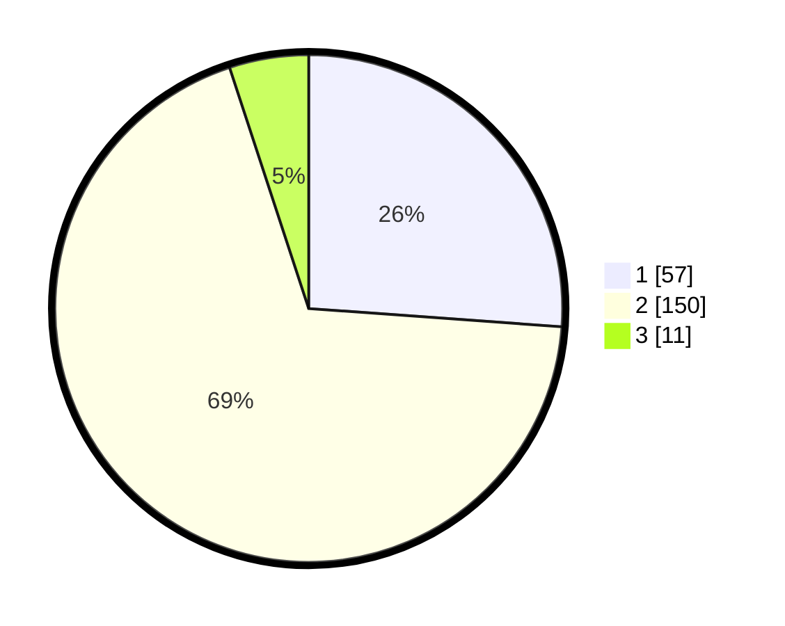

# Hasil

## Grafik

## Tabel

| No. | Nama Paslon    | Suara | Suara (raw) | Persentase |
|:--- |:-------------- | -----:| -----------:| ----------:|
| 1   | ANIES MUHAIMIN | 57    | [57][p-1]   | 26,15      |
| 2   | PRABOWO GIBRAN | 150   | [150][p-2]  | 68,81      |
| 3   | GANJAR MAHFUD  | 11    | [11][p-3]   | 5,05       |

[p-1]: https://github.com/gigit-pemilu/pemilu-2024/blob/main/pilpres/hitung-suara/sub/15-jambi/sub/71-kota-jambi/sub/10-danau-sipin/sub/1001-sungai-putri/sub/005-tps/sub/paslon-1.txt
[p-2]: https://github.com/gigit-pemilu/pemilu-2024/blob/main/pilpres/hitung-suara/sub/15-jambi/sub/71-kota-jambi/sub/10-danau-sipin/sub/1001-sungai-putri/sub/005-tps/sub/paslon-2.txt
[p-3]: https://github.com/gigit-pemilu/pemilu-2024/blob/main/pilpres/hitung-suara/sub/15-jambi/sub/71-kota-jambi/sub/10-danau-sipin/sub/1001-sungai-putri/sub/005-tps/sub/paslon-3.txt

## Foto C Plano

https://sirekap-obj-formc.kpu.go.id/694f/pemilu/ppwp/15/71/10/10/01/1571101001005-20240215-073845--fb2348a8-76b5-4703-827b-a6e0ff9c9257.jpg

https://sirekap-obj-formc.kpu.go.id/694f/pemilu/ppwp/15/71/10/10/01/1571101001005-20240215-074049--4d6ae4fa-5311-47ba-82e6-355b6fc14d6f.jpg

https://sirekap-obj-formc.kpu.go.id/694f/pemilu/ppwp/15/71/10/10/01/1571101001005-20240215-074319--d9e05627-2763-42c9-b3ed-309c6fbc13ad.jpg

## Metadata

| Key        | Value               |
| ---------- | ------------------- |
| Time Stamp | 2024-02-15 21:30:27 |

