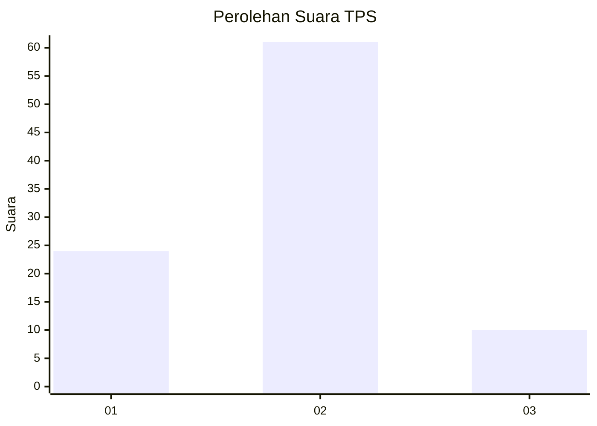

# Hasil

## Grafik

## Tabel

| No. | Nama Paslon    | Suara | Suara (raw) | Persentase |
|:--- |:-------------- | -----:| -----------:| ----------:|
| 1   | ANIES MUHAIMIN | 24    | [24][p-1]   | 25,26      |
| 2   | PRABOWO GIBRAN | 61    | [61][p-2]   | 64,21      |
| 3   | GANJAR MAHFUD  | 10    | [10][p-3]   | 10,53      |

[p-1]: https://github.com/gigit-pemilu/pemilu-2024-15-jambi/blob/main/pilpres/hitung-suara/sub/15-jambi/sub/71-kota-jambi/sub/10-danau-sipin/sub/1005-solok-sipin/sub/033-tps/sub/paslon-1.txt
[p-2]: https://github.com/gigit-pemilu/pemilu-2024-15-jambi/blob/main/pilpres/hitung-suara/sub/15-jambi/sub/71-kota-jambi/sub/10-danau-sipin/sub/1005-solok-sipin/sub/033-tps/sub/paslon-2.txt
[p-3]: https://github.com/gigit-pemilu/pemilu-2024-15-jambi/blob/main/pilpres/hitung-suara/sub/15-jambi/sub/71-kota-jambi/sub/10-danau-sipin/sub/1005-solok-sipin/sub/033-tps/sub/paslon-3.txt

## Foto C Plano

https://sirekap-obj-formc.kpu.go.id/048b/pemilu/ppwp/15/71/10/10/05/1571101005033-20240215-045935--7a29345b-e249-4464-822b-52edf8829034.jpg

https://sirekap-obj-formc.kpu.go.id/048b/pemilu/ppwp/15/71/10/10/05/1571101005033-20240215-011654--373d1de6-81cf-48a9-a288-d106c918f92f.jpg

https://sirekap-obj-formc.kpu.go.id/048b/pemilu/ppwp/15/71/10/10/05/1571101005033-20240215-011750--e11058e2-4142-4371-a41c-ccd72674f0b3.jpg

## Metadata

| Key        | Value               |
| ---------- | ------------------- |
| Time Stamp | 2024-02-16 02:30:27 |

