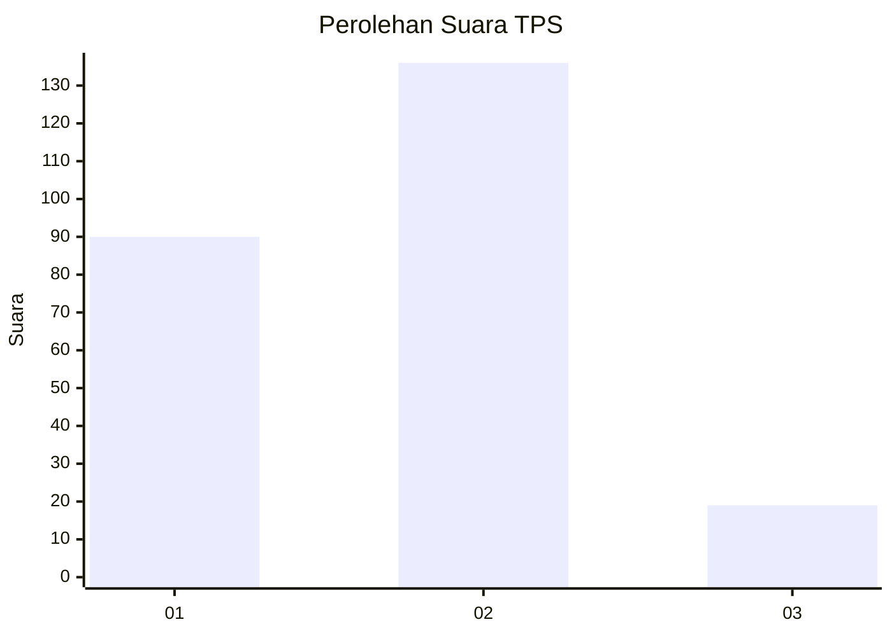

# Hasil

## Grafik

## Tabel

| No. | Nama Paslon    | Suara | Suara (raw) | Persentase |
|:--- |:-------------- | -----:| -----------:| ----------:|
| 1   | ANIES MUHAIMIN | 90    | [90][p-1]   | 36,73      |
| 2   | PRABOWO GIBRAN | 136   | [136][p-2]  | 55,51      |
| 3   | GANJAR MAHFUD  | 19    | [19][p-3]   | 7,76       |

[p-1]: https://github.com/gigit-pemilu/pemilu-2024-15-jambi/blob/main/pilpres/hitung-suara/sub/15-jambi/sub/71-kota-jambi/sub/11-paal-merah/sub/1001-talang-bakung/sub/004-tps/sub/paslon-1.txt
[p-2]: https://github.com/gigit-pemilu/pemilu-2024-15-jambi/blob/main/pilpres/hitung-suara/sub/15-jambi/sub/71-kota-jambi/sub/11-paal-merah/sub/1001-talang-bakung/sub/004-tps/sub/paslon-2.txt
[p-3]: https://github.com/gigit-pemilu/pemilu-2024-15-jambi/blob/main/pilpres/hitung-suara/sub/15-jambi/sub/71-kota-jambi/sub/11-paal-merah/sub/1001-talang-bakung/sub/004-tps/sub/paslon-3.txt

## Foto C Plano

https://sirekap-obj-formc.kpu.go.id/e507/pemilu/ppwp/15/71/11/10/01/1571111001004-20240214-202725--9ee3af5c-9bb1-4a8e-85e3-aae44810b58a.jpg

https://sirekap-obj-formc.kpu.go.id/e507/pemilu/ppwp/15/71/11/10/01/1571111001004-20240214-202907--ac8c3849-f087-4962-bd18-a9da608c772d.jpg

https://sirekap-obj-formc.kpu.go.id/e507/pemilu/ppwp/15/71/11/10/01/1571111001004-20240214-203109--6babcbe1-76dc-4f26-bd76-235b324d4c95.jpg

## Metadata

| Key        | Value               |
| ---------- | ------------------- |
| Time Stamp | 2024-02-16 03:00:26 |

