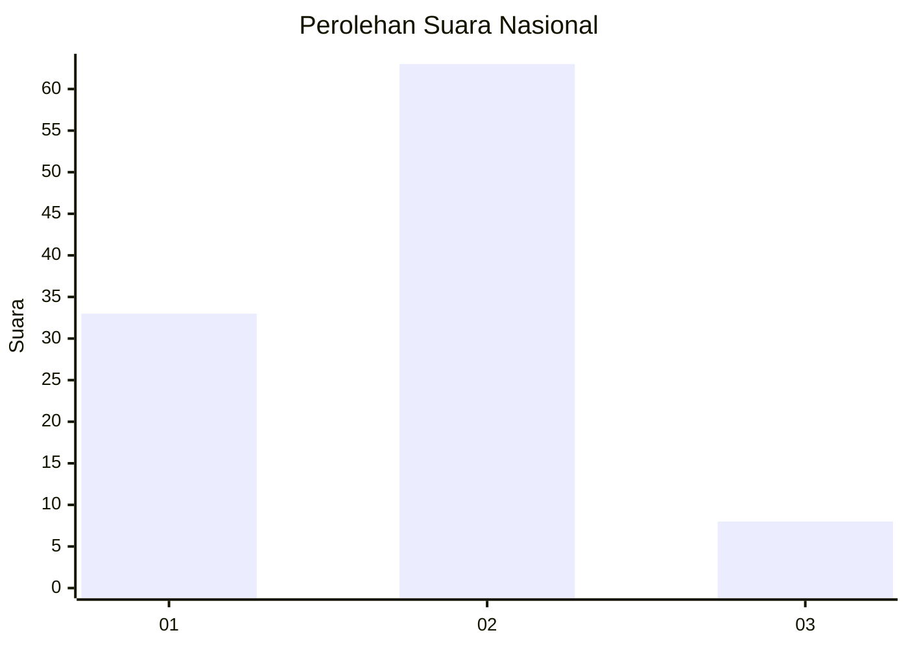
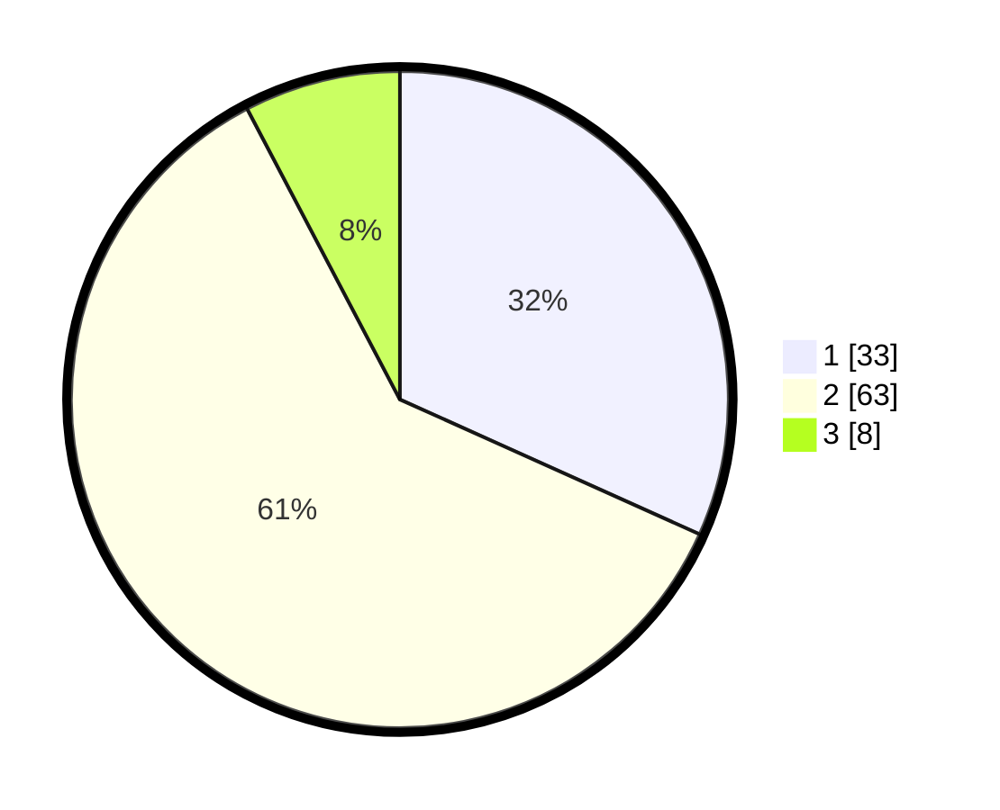

# Hasil

## Grafik

## Tabel

| No. | Nama Paslon    | Suara | Suara (raw) | Persentase |
|:--- |:-------------- | -----:| -----------:| ----------:|
| 1   | ANIES MUHAIMIN | 33    | [33][p-1]   | 31,73      |
| 2   | PRABOWO GIBRAN | 63    | [63][p-2]   | 60,58      |
| 3   | GANJAR MAHFUD  | 8     | [8][p-3]    | 7,69       |

[p-1]: https://github.com/gigit-pemilu/pemilu-2024/blob/main/pilpres/hitung-suara/sub/15-jambi/sub/71-kota-jambi/sub/11-paal-merah/sub/1001-talang-bakung/sub/007-tps/sub/paslon-1.txt
[p-2]: https://github.com/gigit-pemilu/pemilu-2024/blob/main/pilpres/hitung-suara/sub/15-jambi/sub/71-kota-jambi/sub/11-paal-merah/sub/1001-talang-bakung/sub/007-tps/sub/paslon-2.txt
[p-3]: https://github.com/gigit-pemilu/pemilu-2024/blob/main/pilpres/hitung-suara/sub/15-jambi/sub/71-kota-jambi/sub/11-paal-merah/sub/1001-talang-bakung/sub/007-tps/sub/paslon-3.txt

## Foto C Plano

https://sirekap-obj-formc.kpu.go.id/78a0/pemilu/ppwp/15/71/11/10/01/1571111001007-20240214-232151--feb87b4a-db7d-400a-9c81-7516284a572c.jpg

https://sirekap-obj-formc.kpu.go.id/78a0/pemilu/ppwp/15/71/11/10/01/1571111001007-20240214-231855--d74c82ad-ad29-4fce-bdee-1518855d508f.jpg

https://sirekap-obj-formc.kpu.go.id/78a0/pemilu/ppwp/15/71/11/10/01/1571111001007-20240214-231932--d4ffc207-3cfd-4534-85ce-0c49b4330603.jpg

## Metadata

| Key        | Value               |
| ---------- | ------------------- |
| Time Stamp | 2024-02-15 18:30:25 |

