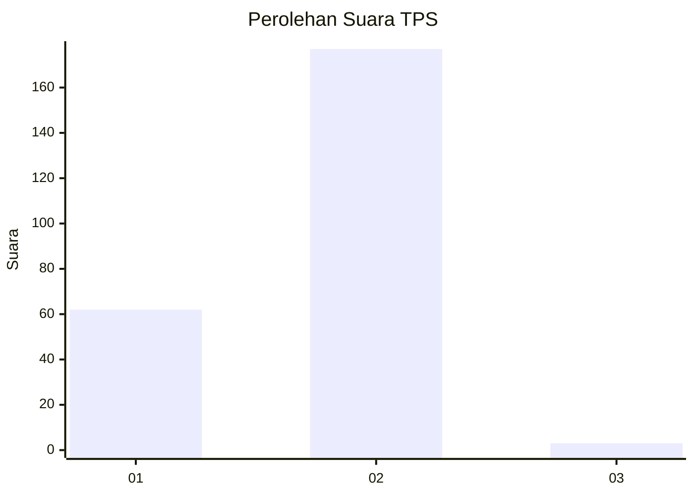
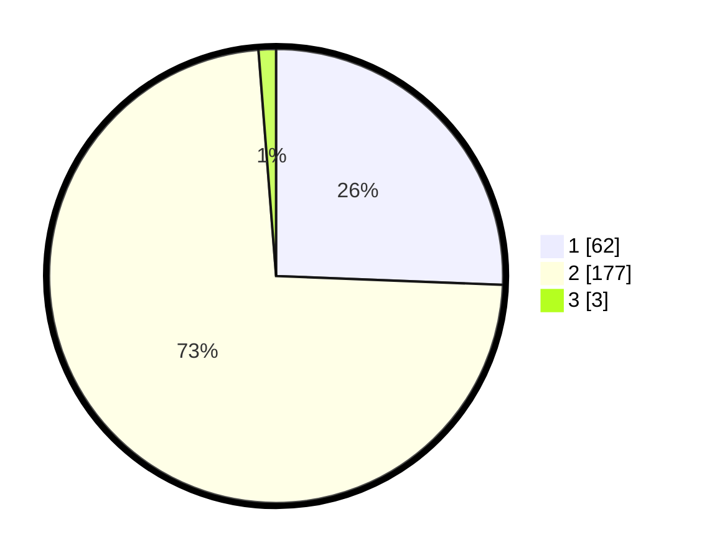

# Hasil

## Grafik

## Tabel

| No. | Nama Paslon    | Suara | Suara (raw) | Persentase |
|:--- |:-------------- | -----:| -----------:| ----------:|
| 1   | ANIES MUHAIMIN | 62    | [62][p-1]   | 25,62      |
| 2   | PRABOWO GIBRAN | 177   | [177][p-2]  | 73,14      |
| 3   | GANJAR MAHFUD  | 3     | [3][p-3]    | 1,24       |

[p-1]: https://github.com/gigit-pemilu/pemilu-2024-15-jambi/blob/main/pilpres/hitung-suara/sub/15-jambi/sub/72-kota-sungai-penuh/sub/03-hamparan-rawang/sub/2003-maliki-air/sub/001-tps/sub/paslon-1.txt
[p-2]: https://github.com/gigit-pemilu/pemilu-2024-15-jambi/blob/main/pilpres/hitung-suara/sub/15-jambi/sub/72-kota-sungai-penuh/sub/03-hamparan-rawang/sub/2003-maliki-air/sub/001-tps/sub/paslon-2.txt
[p-3]: https://github.com/gigit-pemilu/pemilu-2024-15-jambi/blob/main/pilpres/hitung-suara/sub/15-jambi/sub/72-kota-sungai-penuh/sub/03-hamparan-rawang/sub/2003-maliki-air/sub/001-tps/sub/paslon-3.txt

## Foto C Plano

https://sirekap-obj-formc.kpu.go.id/3950/pemilu/ppwp/15/72/03/20/03/1572032003001-20240214-190546--44122624-8d3f-4b13-a8ea-48838b47a90d.jpg

https://sirekap-obj-formc.kpu.go.id/3950/pemilu/ppwp/15/72/03/20/03/1572032003001-20240214-185852--4130d538-1104-4111-82b7-b5f46bc08651.jpg

https://sirekap-obj-formc.kpu.go.id/3950/pemilu/ppwp/15/72/03/20/03/1572032003001-20240214-185654--4dbb5667-9a52-4b87-b883-b658b1af1e56.jpg

## Metadata

| Key        | Value               |
| ---------- | ------------------- |
| Time Stamp | 2024-02-15 21:30:27 |

