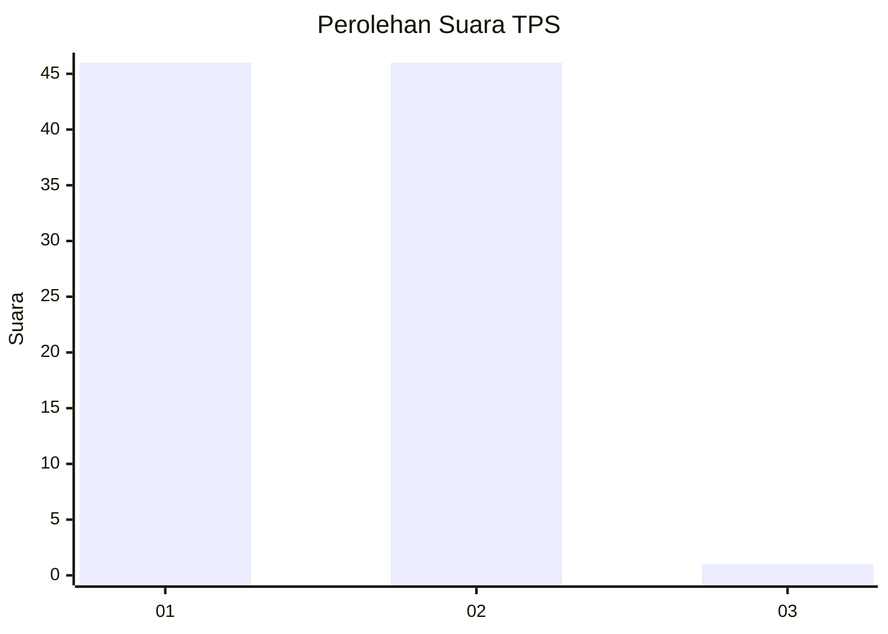
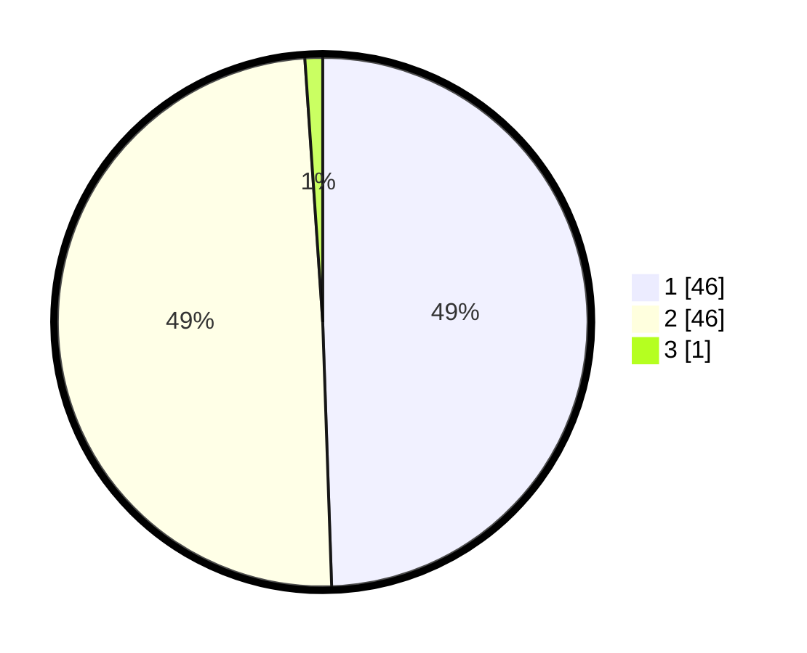

# Hasil

## Grafik

## Tabel

| No. | Nama Paslon    | Suara | Suara (raw) | Persentase |
|:--- |:-------------- | -----:| -----------:| ----------:|
| 1   | ANIES MUHAIMIN | 46    | [46][p-1]   | 49,46      |
| 2   | PRABOWO GIBRAN | 46    | [46][p-2]   | 49,46      |
| 3   | GANJAR MAHFUD  | 1     | [1][p-3]    | 1,08       |

[p-1]: https://github.com/gigit-pemilu/pemilu-2024-15-jambi/blob/main/pilpres/hitung-suara/sub/15-jambi/sub/72-kota-sungai-penuh/sub/07-koto-baru/sub/2003-kampung-tengah/sub/001-tps/sub/paslon-1.txt
[p-2]: https://github.com/gigit-pemilu/pemilu-2024-15-jambi/blob/main/pilpres/hitung-suara/sub/15-jambi/sub/72-kota-sungai-penuh/sub/07-koto-baru/sub/2003-kampung-tengah/sub/001-tps/sub/paslon-2.txt
[p-3]: https://github.com/gigit-pemilu/pemilu-2024-15-jambi/blob/main/pilpres/hitung-suara/sub/15-jambi/sub/72-kota-sungai-penuh/sub/07-koto-baru/sub/2003-kampung-tengah/sub/001-tps/sub/paslon-3.txt

## Foto C Plano

https://sirekap-obj-formc.kpu.go.id/2c73/pemilu/ppwp/15/72/07/20/03/1572072003001-20240215-074155--ae3753c3-0390-405e-afdf-47ea17f90cde.jpg

https://sirekap-obj-formc.kpu.go.id/2c73/pemilu/ppwp/15/72/07/20/03/1572072003001-20240215-074216--ff2071e6-0c7e-4952-b8cb-d12b8a5b4794.jpg

https://sirekap-obj-formc.kpu.go.id/2c73/pemilu/ppwp/15/72/07/20/03/1572072003001-20240215-074236--c7518233-f5b7-4ad6-a227-0b772fde0694.jpg

## Metadata

| Key        | Value               |
| ---------- | ------------------- |
| Time Stamp | 2024-02-15 18:30:25 |

