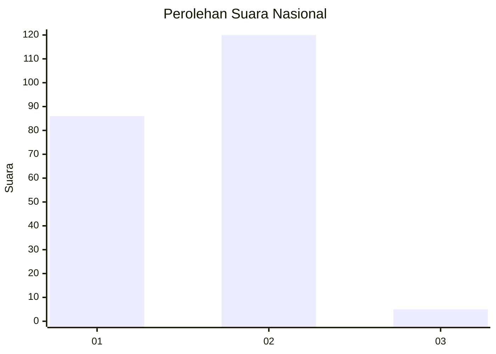
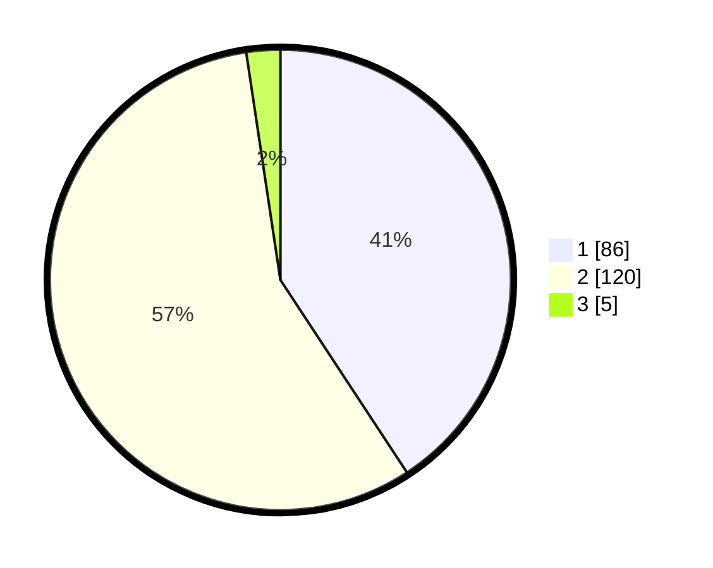

# Hasil

## Grafik

## Tabel

| No. | Nama Paslon    | Suara | Suara (raw) | Persentase |
|:--- |:-------------- | -----:| -----------:| ----------:|
| 1   | ANIES MUHAIMIN | 86    | [86][p-1]   | 40,76      |
| 2   | PRABOWO GIBRAN | 120   | [120][p-2]  | 56,87      |
| 3   | GANJAR MAHFUD  | 5     | [5][p-3]    | 2,37       |

[p-1]: https://github.com/gigit-pemilu/pemilu-2024/blob/main/pilpres/hitung-suara/sub/15-jambi/sub/72-kota-sungai-penuh/sub/08-sungai-bungkal/sub/1005-dusun-baru/sub/006-tps/sub/paslon-1.txt
[p-2]: https://github.com/gigit-pemilu/pemilu-2024/blob/main/pilpres/hitung-suara/sub/15-jambi/sub/72-kota-sungai-penuh/sub/08-sungai-bungkal/sub/1005-dusun-baru/sub/006-tps/sub/paslon-2.txt
[p-3]: https://github.com/gigit-pemilu/pemilu-2024/blob/main/pilpres/hitung-suara/sub/15-jambi/sub/72-kota-sungai-penuh/sub/08-sungai-bungkal/sub/1005-dusun-baru/sub/006-tps/sub/paslon-3.txt

## Foto C Plano

https://sirekap-obj-formc.kpu.go.id/e6d9/pemilu/ppwp/15/72/08/10/05/1572081005006-20240214-155121--b5cafa6b-d3c1-41c6-911b-740856fbd497.jpg

https://sirekap-obj-formc.kpu.go.id/e6d9/pemilu/ppwp/15/72/08/10/05/1572081005006-20240214-155600--3af55302-6bcc-4952-89da-737863aeccbb.jpg

https://sirekap-obj-formc.kpu.go.id/e6d9/pemilu/ppwp/15/72/08/10/05/1572081005006-20240214-155201--a4907a59-0b6b-444d-b4d3-7bce1f2fea6b.jpg

## Metadata

| Key        | Value               |
| ---------- | ------------------- |
| Time Stamp | 2024-02-15 20:00:44 |

